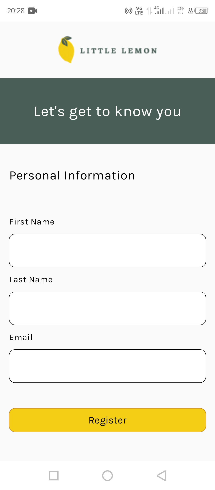
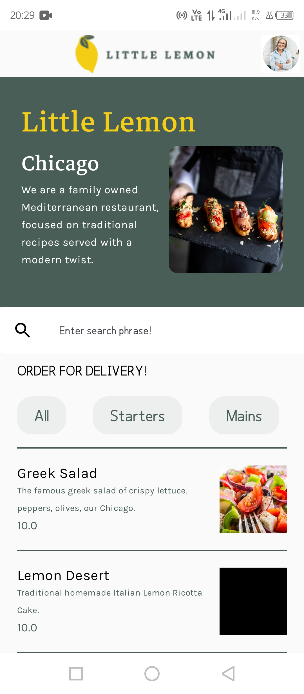
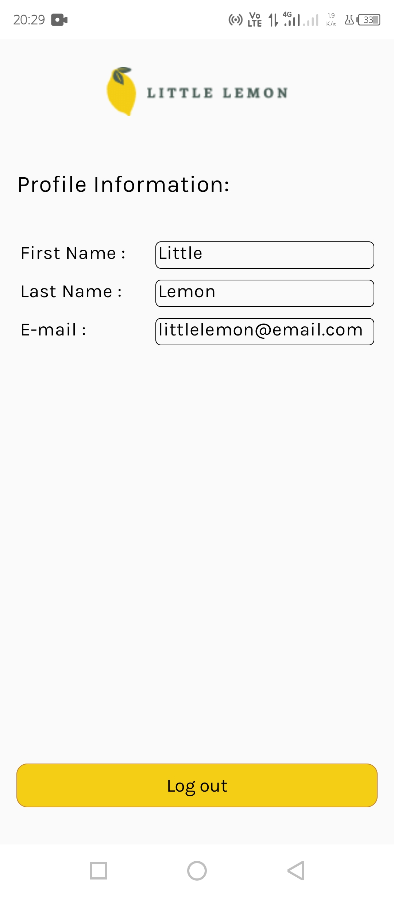

# **Little Lemon Android App**

This repository hosts the 'Little Lemon' Android application, a capstone project from the Meta Android Developer Course. It's a functional app for a fictional restaurant, featuring onboarding, a dynamic menu display, and user profiles.

## **🚀 Technologies & Libraries Used**

This project leverages a modern Android tech stack to deliver a robust and responsive user experience:

* **Architecture:** MVVM (Model-View-ViewModel)  
* **Language:** Kotlin  
* **UI Toolkit:** Jetpack Compose  
* **Image Loading:** Coil  
* **Database:** Room (SQLite)  
* **Dependency Injection:** Hilt  
* **Networking:** Ktor Client  
* **Annotation Processing:** KSP (Kotlin Symbol Processing)  
* **Local Data Storage:** Android Shared Preferences

## **✨ Project Overview**

The Little Lemon app is designed to showcase fundamental Android development concepts, including data persistence, network operations, modern UI development with Jetpack Compose, and robust architecture patterns like MVVM. It serves as a practical demonstration of building a multi-screen application with various interactive elements.

## **🎯 Purpose & Motivation**

This project was developed as a capstone requirement for the Meta Android Developer Course. Its primary goal was to consolidate and apply the knowledge gained throughout the curriculum, covering essential topics such as UI design, data management, API integration, and dependency management within an Android application context.

## **📱 App Functionality**

The application features three main screens, each serving a distinct purpose:

### **1\. Onboarding / Login Screen**

Screenshot:


The initial screen users encounter. It's designed for new users to register their basic details.

* **User Input:** Collects the user's first name, last name, and email address.  
* **Data Persistence:** User details are securely saved via Android's SharedPreferences to maintain login state across sessions.  
* **Navigation:** Once logged in, the user is automatically directed to the Home Screen.  
* Screenshot/Screen Recording: Onboarding/Login Screen  
  (Insert screenshot or screen recording here)

### **2\. Home Screen**

Screenshot:


This is the central hub of the application, displaying information about the Little Lemon restaurant and its menu.

* **Introductory Section:** Features a prominent display of a main dish and general restaurant information.  
* **Remote Data Fetching:** The app fetches menu data from a remote JSON file using Ktor.  
* **Local Data Storage:** The fetched menu data is then persisted locally in a Room SQLite database, ensuring data availability even offline.  
* **Image Display:** Menu item images are loaded and displayed efficiently using the Coil image loading library.  
* **Filtering:** Users can filter the list of menu items based on different dish categories.  
* **Search Functionality:** A search bar allows users to quickly find specific dishes by their names.  
* Screenshot/Screen Recording: Home Screen with Menu List, Filters, and Search  
  (Insert screenshot or screen recording here)

### **3\. Profile Screen**

Screenshot:




Accessible via an icon on the Home Screen, this screen displays the user's registered details and provides a logout option.

* **User Details Display:** Shows the first name, last name, and email address that the user entered during the onboarding process (retrieved from SharedPreferences).  
* **Logout Functionality:** A dedicated logout button clears all saved login data from SharedPreferences, effectively logging the user out and returning them to the Onboarding Screen.  
* Screen Recording:


## **🛠️ Setup and Installation**

To run this project locally, ensure you have Android Studio installed. Then, clone the repository and open it. Ensure you have the latest Android SDK and Kotlin plugin installed.

```
git clone https://github.com/gurungOm0/little-lemon.git
cd LittleLemon 
```

## **🚀 Future Enhancements**

* Add order placement functionality.  
* Implement user reviews and ratings for dishes.  
* Improve UI animations and transitions for a more polished feel.  
* Integrate push notifications for special offers.
